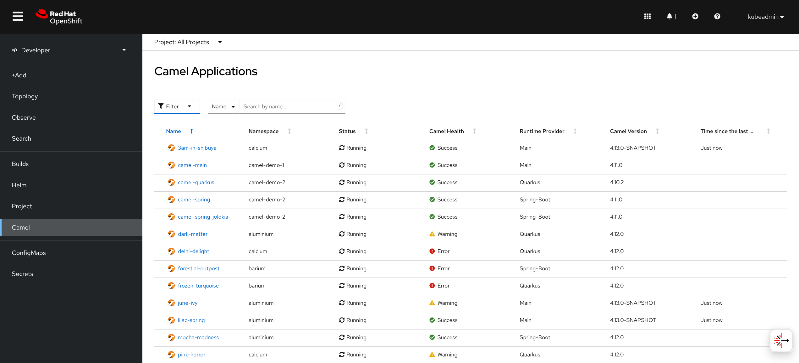

# Camel Openshift Console Plugin

> [!WARNING]
> The project is still a work in progress that has not been released yet. 
> Unstability is to be expected.

This project provides a [console plugin](https://github.com/openshift/console/tree/master/frontend/packages/console-dynamic-plugin-sdk) for [Camel](https://camel.apache.org).
The project is created using [openshift console plugin template](https://github.com/openshift/console-plugin-template)

It requires:
* OpenShift 4.18
* [Camel Dashboard Operator](https://github.com/squakez/camel-dashboard-operator)

It can also leverage the [Hawtio Online OpenShift Console Plugin](https://github.com/hawtio/hawtio-online-console-plugin).

# Local Development

Node.js 20+ and Yarn are required to build and run this locally. To run OpenShift console in a container, [podman 3.2.0+](https://podman.io) or [Docker](https://www.docker.com) is required.

For development you can login to an existing [OpenShift](https://www.redhat.com/en/technologies/cloud-computing/openshift) and run the console with the plugin included locally.

In one terminal window, run:

1. `yarn install`
2. `yarn run start`

In another terminal window, run:

1. `oc login` (requires [oc](https://console.redhat.com/openshift/downloads) and an [OpenShift cluster](https://console.redhat.com/openshift/create))
2. `yarn run start-console` (requires [Docker](https://www.docker.com) or [podman 3.2.0+](https://podman.io))

This will run the OpenShift console in a container connected to the cluster
you've logged into. The plugin HTTP server runs on port 9001 with CORS enabled.
Navigate to <http://localhost:9000/example> to see the running plugin.

# Deployment to OpenShift

To deploy the console plugin to an actual [OpenShift](https://www.redhat.com/en/technologies/cloud-computing/openshift) cluster the following are needed:

- [oc](https://console.redhat.com/openshift/downloads)
- [helm](https://helm.sh)

### Building the images locally

```sh
podman build -t quay.io/camel-tooling/camel-openshift-console-plugin:latest .
podman push quay.io/camel-tooling/camel-openshift-console-plugin:latest
```

**Note**: The image `quay.io/camel-tooling/camel-openshift-console-plguin:latest` is published so it can be pulled instead.

### Deploying the plugin using Helm

```sh
oc new-project plugin-camel-openshift-console-plugin
helm upgrade -i camel-openshift-console-plugin charts/camel-openshift-console-plugin --namespace plugin-camel-openshift-console-plugin --set plugin.image=quay.io/camel-tooling/camel-openshift-console-plugin:latest
```

# The Camel Tab

In the developer perpective the Camel section is now shown:
[](screenshots/home.png)


